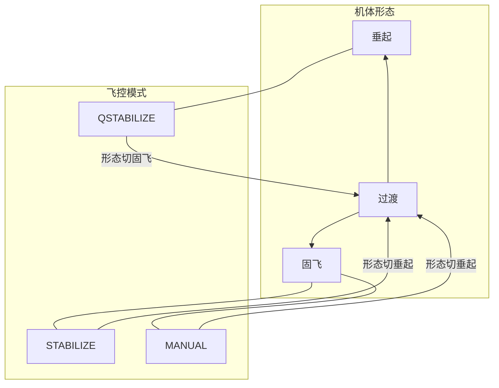
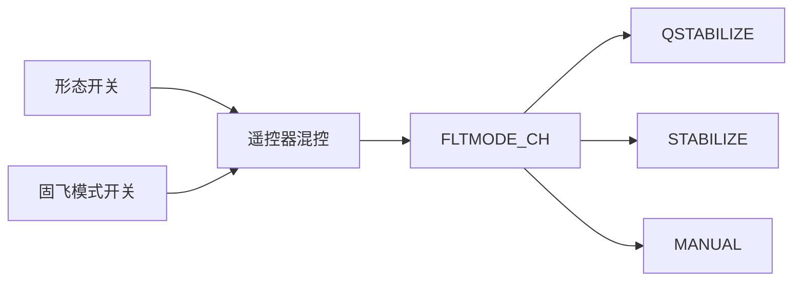

# 飞行形态与模式

本机飞行分两层概念：

1. **机体形态**：垂起、固飞，以及两者之间的**过渡**
2. **固飞控制方式**：飞控自稳（`STABILIZE`）与纯手动（`MANUAL`）

垂起形态下**只有一种**飞控模式：`QSTABILIZE`。硬件与倾转工作区见 [hardware.md](./hardware.md)。

## 双开关分工

遥控器上用**两个独立开关**，语义分离；垂起时固飞模式开关无效。

| 开关 | 作用 | 档位 |
|------|------|------|
| **形态开关** | 垂起 ↔ 固飞 | 2 档 |
| **固飞模式开关** | 仅固飞有效：自稳 ↔ 纯手动 | 2 档 |

### 逻辑真值表

| 形态开关 | 固飞模式开关 | 飞控模式 | 机体形态 |
|----------|--------------|----------|----------|
| 垂起 | （忽略） | `QSTABILIZE`（17） | 垂起 |
| 固飞 | 自稳 | `STABILIZE`（2） | 固飞 |
| 固飞 | 纯手动 | `MANUAL`（0） | 固飞 |

### 模式语义

| 形态 | 飞控模式 | 含义 |
|------|----------|------|
| 垂起 | **仅** `QSTABILIZE` | 悬停姿态自稳；**不用** `QHOVER` |
| 固飞 | `STABILIZE` | 飞控自稳（杆回中回平） |
| 固飞 | `MANUAL` | 纯手动直通 |
| 过渡 | 无独立开关档 | 由**形态开关**切换触发 |

本机正式档位不含 `QHOVER`、`FBWA`。

## 遥控器混控 → `FLTMODE_CH`

ArduPlane **原生只有一路** `FLTMODE_CH` 选模式，不能直接「两路开关各管一层」。本机约定在 **Zorro / EdgeTX** 上把两路开关**混控成一路**，再送给飞控。

约定：

- 合成输出接到飞控的 `FLTMODE_CH`（默认 **CH8**，`FLTMODE_CH=8`）。
- 飞控侧配置三档：`QSTABILIZE` / `STABILIZE` / `MANUAL`；其余 `FLTMODEn` 填同值作垫档，避免误切未定义模式。
- 形态开关为**垂起**时，混控**强制**输出 `QSTABILIZE` 对应 PWM，与固飞模式开关位置无关。
- 形态开关为**固飞**时，混控按固飞模式开关在 `STABILIZE` 与 `MANUAL` 两档 PWM 间选择。

通道建议（实物可改，改后保持语义即可）：

| 物理开关 | 建议 | 说明 |
|----------|------|------|
| 形态 | SA（2 位） | 垂起 / 固飞 |
| 固飞模式 | SB（2 位） | 自稳 / 纯手动 |
| 合成输出 | CH8 | → `FLTMODE_CH` |

本文只给真值表与合成原则，不提供完整 EdgeTX 模型导出。

## 过渡行为

| 操作 | 是否触发形态过渡 |
|------|------------------|
| 形态开关：垂起 ↔ 固飞 | **是**（`QSTABILIZE` ↔ `STABILIZE`/`MANUAL`） |
| 固飞模式开关：自稳 ↔ 纯手动 | **否**（仅固飞内换控制方式） |

- **垂起 → 固飞**：形态开关切固飞 → 进入 `STABILIZE` 或 `MANUAL` → 前飞过渡；倾转由垂直工作区大行程扫向水平工作区（见 [hardware.md](./hardware.md) 倾转端点语义）。
- **固飞 → 垂起**：形态开关切垂起 → 进入 `QSTABILIZE` → 后飞/悬停过渡。

倾转与各轴控制的设计意图、实机形态 / 差动滚转图示、以及固飞 Lua 差动倾转约定，见 [hardware.md](./hardware.md)；刷参与脚本部署见 [ardupilot-setup.md](./ardupilot-setup.md)。本文只定模式与开关体系。

## 安全要点

- 低速 / 垂起侧应急：用**形态开关**切回 **垂起**（`QSTABILIZE`）。
- 勿在低速把形态切到固飞、且停在 `MANUAL` 当作「应急」——会压前飞并停 VTOL，危险。
- 固飞内可用固飞模式开关在自稳与纯手动间切换，不改变形态。
