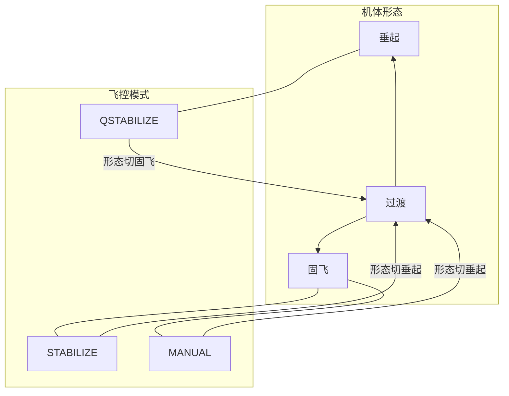
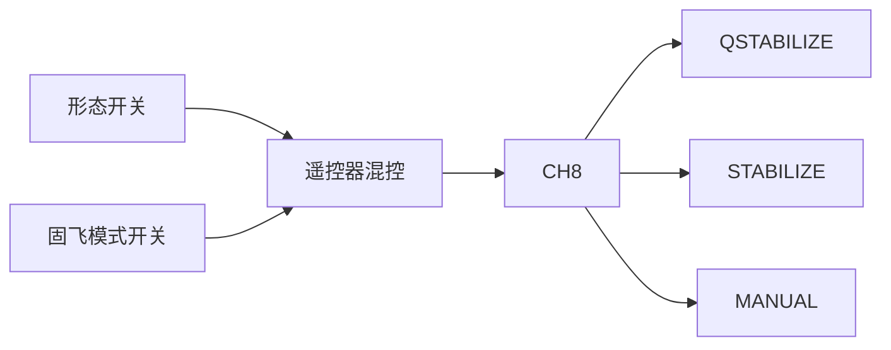

# 飞行形态与模式

本机飞行分两层概念：

1. **机体形态**：垂起、固飞，以及两者之间的**过渡**
2. **固飞控制方式**：飞控自稳（`STABILIZE`）与纯手动（`MANUAL`）

垂起形态下**只有一种**飞控模式：`QSTABILIZE`。硬件与倾转工作区见 [hardware.md](./hardware.md)。

```mermaid
flowchart TB
  subgraph morph [机体形态]
    vtol[垂起]
    trans[过渡]
    fw[固飞]
  end
  subgraph modes [飞控模式]
    qstab[QSTABILIZE]
    stab[STABILIZE]
    man[MANUAL]
  end
  vtol --- qstab
  fw --- stab
  fw --- man
  qstab -->|"形态切固飞"| trans
  stab -->|"形态切垂起"| trans
  man -->|"形态切垂起"| trans
  trans --> fw
  trans --> vtol
```

## 双开关分工

遥控器上用**两个独立开关**，语义分离；垂起时固飞模式开关无效。

| 开关 | 作用 | 档位 |
|------|------|------|
| **形态开关** | 垂起 ↔ 固飞 | 2 档 |
| **固飞模式开关** | 仅固飞有效：自稳 ↔ 纯手动 | 2 档 |

### 逻辑真值表

| 形态开关 | 固飞模式开关 | 飞控模式 | 机体形态 |
|----------|--------------|----------|----------|
| 垂起 | （忽略） | `QSTABILIZE`（17） | 垂起 |
| 固飞 | 自稳 | `STABILIZE`（2） | 固飞 |
| 固飞 | 纯手动 | `MANUAL`（0） | 固飞 |

### 模式语义

| 形态 | 飞控模式 | 含义 |
|------|----------|------|
| 垂起 | **仅** `QSTABILIZE` | 悬停姿态自稳；**不用** `QHOVER`。尾电机为 Motor4 |
| 固飞 | `STABILIZE` | 飞控自稳（杆回中回平） |
| 固飞 | `MANUAL` | 纯手动直通 |
| 过渡 | 无独立开关档 | 由**形态开关**切换触发 |

本机正式档位不含 `QHOVER`、`FBWA`。垂起（`QSTABILIZE` 解锁）时尾电机为原生 Motor4，参与三旋翼混控。固飞时 Lua 让前电机跟油门杆（含偏航差动），尾电机写 MIN 停转。

## 遥控器混控 → `FLTMODE_CH`

ArduPlane **原生只有一路** `FLTMODE_CH` 选模式，不能直接「两路开关各管一层」。本机约定在 **Zorro / EdgeTX** 上把两路开关**混控成一路**，再送给飞控。

```mermaid
flowchart LR
  swMorph[形态开关]
  swFw[固飞模式开关]
  mix[遥控器混控]
  ch8[CH8]
  swMorph --> mix
  swFw --> mix
  mix --> ch8
  ch8 --> qstab[QSTABILIZE]
  ch8 --> stab[STABILIZE]
  ch8 --> man[MANUAL]
```

约定：

- 合成输出仍在 **CH8**。`FLTMODE_CH=0`，固件不按这个通道改模式；[`tilttri_fw_tilt_aileron.lua`](../lua/tilttri_fw_tilt_aileron.lua) 读 CH8，按与 `FLTMODE1..6` 相同的六段 PWM 选择 `QSTABILIZE` / `STABILIZE` / `MANUAL`。
- 飞控侧仍配置三档垫档：`FLTMODE1..6=17,17,2,2,0,0`。脚本里的槽位表与此一致；把 `FLTMODE_CH` 设回 8 时固件也用这张表。脚本运行期间不要设回 8，否则会和脚本抢模式。
- 形态开关为**垂起**时，混控**强制**输出 `QSTABILIZE` 对应 PWM，与固飞模式开关位置无关。
- 形态开关为**固飞**时，混控按固飞模式开关在 `STABILIZE` 与 `MANUAL` 两档 PWM 间选择。

通道建议（实物可改，改后保持语义即可）：

| 物理开关 | 建议 | 说明 |
|----------|------|------|
| 形态 | SA（2 位） | 垂起 / 固飞 |
| 固飞模式 | SB（2 位） | 自稳 / 纯手动 |
| 合成输出 | CH8 | Lua 读取；`FLTMODE_CH=0` |

本文只给真值表与合成原则，不提供完整 EdgeTX 模型导出。

## 过渡行为

| 操作 | 是否触发形态过渡 |
|------|------------------|
| 形态开关：垂起 → 固飞 | **是**。模式先保持 `QSTABILIZE`，倾转共模扫过 `BTILT_QFRAC` 后才进入当时开关所选的 `STABILIZE` 或 `MANUAL` |
| 形态开关：固飞 → 垂起 | **是**。立即回到 `QSTABILIZE`，电机立刻交回混控；倾转由 Lua 按 `Q_TILT_RATE_UP` 扫回垂起角，到位后才松开 |
| 固飞模式开关：自稳 ↔ 纯手动 | **否**（不重新扫倾转）。保持期间只决定过阈值后进入哪个固飞模式；已经在固飞后立即切换 |

- **垂起 → 固飞**：形态开关切固飞后，飞控模式仍是 `QSTABILIZE`，三电机仍由垂起混控。Lua 只把左右倾转从当前位置共模扫向 `BTILT_HORIZ_*`（`Q_TILT_RATE_DN`），这段没有 vectored yaw，也没有固飞差动。左右较慢的一侧都走过行程的 `BTILT_QFRAC`（默认 0.7）之后，才 `set_mode` 到开关所选的固飞模式，电机约 300 ms 从混控油门收到固飞目标（前电机跟油门杆，尾电机停转），剩余倾转继续扫完并开始差动。见 [hardware.md](./hardware.md) 倾转端点语义。
- **固飞 → 垂起**：形态开关切垂起 → 立即进入 `QSTABILIZE`，三电机立刻交回混控。倾转不交给固件硬切：固件固飞角在真水平以下（更朝前），松手会先猛地向下一截再收回。Lua 从当前 PWM 按 `Q_TILT_RATE_UP` 扫回进入过渡前的垂起角（`BTILT: qrecover`），到位后才松开，vectored yaw 恢复。保持途中拨回也走这一段。见 [ardupilot-setup.md](./ardupilot-setup.md) §3 / §4。
- `BTILT_QFRAC=0` 只取消这段保持（拨固飞后立刻进入目标模式）。不能用它代替把 `FLTMODE_CH` 设回 8。

倾转与各轴控制的设计意图、实机形态 / 差动滚转图示、以及固飞 Lua 差动倾转约定，见 [hardware.md](./hardware.md)；刷参与脚本部署见 [ardupilot-setup.md](./ardupilot-setup.md)。本文只定模式与开关体系。

## 安全要点

- 低速 / 垂起侧应急：用**形态开关**切回 **垂起**（`QSTABILIZE`）。扫角前半段拨回会立刻松开倾转覆写。
- 勿在低速把形态切到固飞、且停在 `MANUAL` 当作「应急」——过 `BTILT_QFRAC` 之后会停掉垂起混控，危险。
- 固飞内可用固飞模式开关在自稳与纯手动间切换，不改变形态，也不重新扫倾转。
- `FLTMODE_CH=0` 时，脚本没在跑遥控就不能换模式。解锁前 GCS 必须已有 `BTILT: tilttri fw tilt+throttle running` 和 `BTILT: qhold on`。
