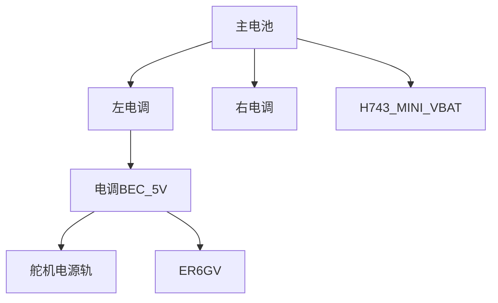
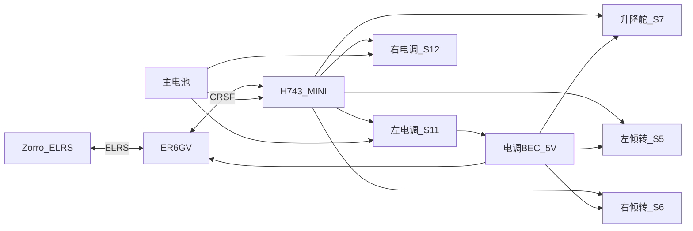

# 硬件构型与接线

本机为 **双旋翼倾转翼（BiCopter / Tilt-Wing）**：外段主翼与电机一体倾转。飞控 **Matek H743-MINI V3**（ArduPlane），遥控 RadioMaster **Zorro**（ELRS）+ **ER6GV**（CRSF）。执行机构全部由飞控 PWM 驱动；接收机不直驱舵机/电调。

说明：ArduPlane 文档中 BiCopter 的 “Tailsitter” 为历史命名，**不是**机尾着地 tailsitter。

## 气动 / 机体布局

| 项目 | 配置 |
|------|------|
| 结构 | 左右外段主翼与对应电机一体倾转；倾转同时改变该段迎角与推力线 |
| 旋翼 | 左右各 1，**对转** |
| 独立气动舵面 | **仅平尾升降舵** |
| 无独立舵面 | 无副翼、无襟翼、无方向舵 |

虽无独立副翼 / 方向舵面，设计上由倾转机构与双电机分别承担对应职能：

- **横滚（等效副翼）**：固飞时左右外段相对水平差动倾转 → 左右迎角差 → 滚转力矩（设计意图；见下文与 stock 的差异）
- **偏航（等效方向舵）**：左右电机差动推力
- **俯仰**：平尾升降舵

### 各轴控制简表

| 轴 | 悬停 | 固飞（设计意图） |
|----|------|------------------|
| 滚转 | 左右差动推力 | 外段相对水平差动倾转（等效副翼） |
| 俯仰 | 对称倾转 / 推力分配 | 平尾升降舵 |
| 偏航 | 左右翼差动倾转矢量 | 左右电机差动推力（等效方向舵） |

## 执行机构

| 机构 | 作用 | 说明 |
|------|------|------|
| 左倾转舵机 | 左外段整翼倾转 | 设计上固飞兼差动横滚 |
| 右倾转舵机 | 右外段整翼倾转 | 同上 |
| 平尾升降舵 | 固飞俯仰 | 唯一独立气动舵面 |
| 左 / 右电调 + 电机 | 推力 | 对转；固飞可差动偏航 |

### 倾转端点语义（BiCopter）

#### 本机运动学（设计意图）

倾转机构在两种稳态形态下各自以该形态中心做**小行程**控制；水平 ↔ 垂直的**大行程**只出现在形态转换。

| 形态 | 中心姿态 | 小行程 |
|------|----------|--------|
| 固飞 | 水平 | 相对水平上下差动（等效副翼） |
| 垂起 | 垂直 | 相对垂直前后矢量（偏航等） |
| 转换 | 水平 ↔ 垂直渐变 | 大行程扫过；非稳态小行程 |

#### 官方 BiCopter 绝对端点

ArduPlane stock BiCopter（`Q_TILT_TYPE=3`）用 `SERVOn_MIN` / `TRIM` / `MAX` 标定**全行程**端点：

| `SERVOn_*` | 官方约定 |
|------------|----------|
| MIN | 水平（固飞侧端点） |
| TRIM | 垂直（垂起中心） |
| MAX | 垂直后再仰（垂起偏航极限） |

占位 PWM 常为 MIN=1000、TRIM=1500、MAX=2000，须按机械行程台架标定。垂起侧相对垂直的前/后偏角由 `Q_TILT_YAW_ANGLE` 限制，与 MAX 配套。

该表是 stock 全行程标定约定，**不是**上表「形态内工作区」。关键矛盾：

- **MIN = 水平 ⇒ PWM 无法越过水平再向下**，与「以水平为中心、上下双向副翼」不兼容。
- stock 在非 VTOL 且已前倾到位（`fully_fwd`）时，左右倾转被锁在 `-SERVO_MAX`（即 MIN / 水平），**无**固飞差动副翼。

本机设计需要的「水平为中心 ± 小行程」超出上述官方映射；落地需改标定模型或改固件（另开任务）。本文只记录设计意图与 stock 差异，不把 MIN/TRIM/MAX 当作已覆盖该能力。

## 飞控输出映射

物理通道号可变，**`SERVOn_FUNCTION` ID 不变**。

H743-MINI **V3** 侧面焊盘为 S1–S8、S11、S12（**无 S9/S10**）。本机用侧面焊盘 **S5–S8 / S11–S12**，不用 JST 上的 S1–S4。

| 飞控输出 | `SERVOn_FUNCTION` | 设备 |
|----------|-------------------|------|
| S5 | 75（TiltMotorLeft） | 左机翼倾转 |
| S6 | 76（TiltMotorRight） | 右机翼倾转 |
| S7 | 19（Elevator） | 平尾升降舵 |
| S11 | 73（ThrottleLeft） | 左电机 ESC 信号 |
| S12 | 74（ThrottleRight） | 右电机 ESC 信号 |

约束：

- 倾转 S5/S6 同定时器组；电机须用 S11/S12 单独一组。
- **勿把电调接到 S5–S8**（与舵机混组会锁死低 PWM 频率）。
- MatekH743 定时器组：`1/2`，`3/4/5/6`，`7/8/9/10`，`11/12`，`13`。
- 机翼舵机只映射倾转功能，勿再映射 `Aileron=4`。
- 悬停阶段 ESC 信号类型为普通 PWM（非 DShot）。
- 电调：信号线接对应 `Sn`，动力线接主电池；信号地与飞控共地。

## 遥控链路

| 组件 | 型号 / 协议 |
|------|-------------|
| 发射机 | RadioMaster Zorro（内置 ELRS 2.4G） |
| 接收机 | RadioMaster ER6GV（V = Vario 气压计，非陀螺） |
| 接收机 → 飞控 | CRSF（`RX6` / `TX6`） |
| 通道顺序 | 建议 AETR |
| 模式开关 | 默认 RC CH8（`FLTMODE_CH=8`） |

ELRS 要求遥控器 **CH5 为 Arm**（射频侧）；与飞控 `ARMING` 通道可分开理解。

### ER6GV → 飞控（CRSF）

ER6GV 无独立串口焊盘；需在 WebUI 将两路 PWM 口改为串口并选 CRSF。

1. 接收机上电进入 WiFi（LUA 开启，或上电约 60 s 后）。
2. 连接 `ExpressLRS RX`，浏览器打开 `10.0.0.1`。
3. **PWM Output**：Channel 2 = `Serial TX`（Channel 3 自动为 `Serial RX`）。
4. **Serial Protocol** = `CRSF`，保存。

| ER6GV | 飞控（H743-MINI） | 说明 |
|-------|-------------------|------|
| CH2 信号（Serial TX） | `RX6` | 接收机 TX → 飞控 RX |
| CH3 信号（Serial RX） | `TX6` | 接收机 RX → 飞控 TX |
| 任意 CH1–5 的 5V / GND | 电调 BEC 5V / GND | 与舵机电源共地；**勿从 CH6 取电** |
| 可选：PCB `EXT-V` | 主电池正极 | 电压回传，输入 ≤ 35 V |

接线对照参数（写入后需重启飞控）：

| 参数 | 值 | 说明 |
|------|-----|------|
| `BRD_ALT_CONFIG` | 1 | `RX6` 作真 UART RX（SERIAL7） |
| `SERIAL7_PROTOCOL` | 23 | RC / CRSF |
| `SERIAL7_OPTIONS` | 0 | CRSF 默认 |

## 电源与共地

约定：主电池并行供给左右电调与飞控 `VBAT`；舵机电源轨与 ER6GV 由**一路电调 BEC 5V**供电。

要点：

- 两路电调都有 BEC 时，只接**一路** 5V 到舵机轨 / 接收机；另一路 BEC 的 5V 拔掉或绝缘，避免并联。
- 飞控逻辑电由板载电源从 `VBAT` 产生；**禁止**把主电池高压接到接收机或舵机 5V。
- 电池监测按 MINI 实际硬件标定，勿照搬 H743-WING 电流计参数。

## 系统拓扑

## 接线检查清单（拆桨）

- [ ] Zorro 与 ER6GV 已对频，ELRS 固件大版本一致
- [ ] ER6GV：CH2/CH3 为 Serial TX/RX，协议 CRSF；供电来自 CH1–5，非 CH6
- [ ] 飞控：`RX6`/`TX6` 交叉接妥；`BRD_ALT_CONFIG=1`，`SERIAL7_PROTOCOL=23`，已重启
- [ ] Mission Planner 有 RC 输入；可选确认 CRSF 遥测
- [ ] 仅一路 BEC 5V；舵机轨与接收机、飞控信号地共地
- [ ] S5 / S6 / S7 / S11 / S12 与功能 75 / 76 / 19 / 73 / 74 一致

## 未记录规格

下列项在来源配置中**未给出具体型号或数值**，后续补全：

- 电机型号、KV、桨径与桨型
- 电调品牌、电流规格
- 主电池电芯数与容量
- 倾转舵机 / 升降舵舵机型号与力矩
- 机体尺寸、空重、重心位置
- 电流计 `BATT_*` 最终标定值
- 倾转机械角度实测终值
